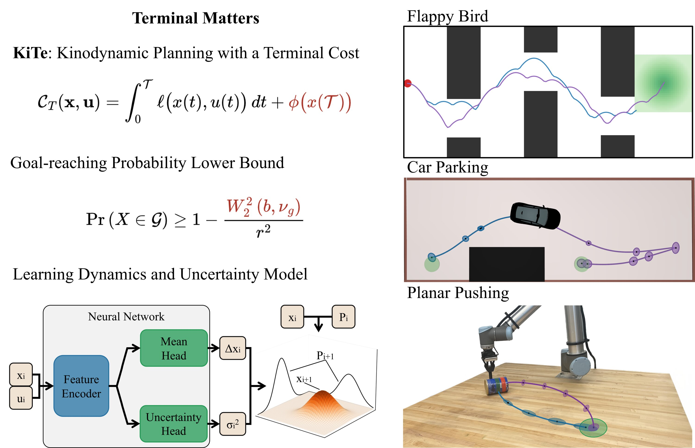
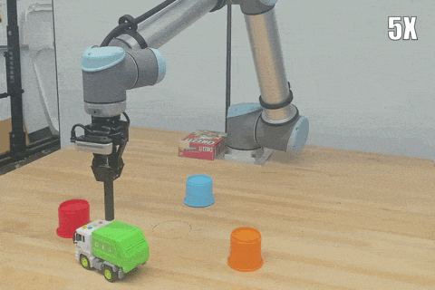
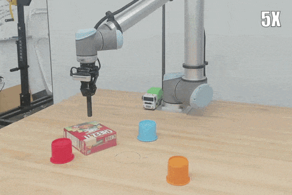
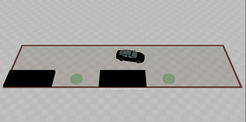
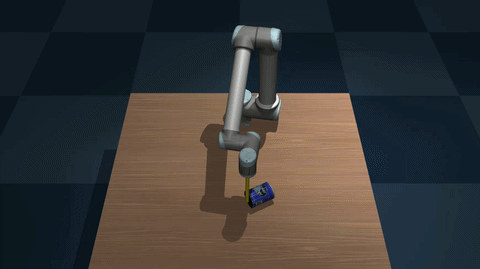

# Terminal Matters: Kinodynamic Planning with a Terminal Cost and Learned Uncertainty in Belief State-Cost Space

Implementation of paper *Terminal Matters: Kinodynamic Planning with a Terminal Cost and Learned Uncertainty in Belief State-Cost Space*. This paper proposes sampling-based **Ki**nodynamic planning with a **Te**rminal cost, termed **KiTe**, and highlights the importance of terminal-state optimization in both deterministic planning and belief-space planning.

[Paper TBA] [Pre-print TBA] [Presentation Video TBA]

<p align="center">
    
</p>

<table align="center">
  <tr>
    <td align="center">
      <a href="https://youtu.be/">
        
      </a>
    </td>
    <td align="center">
      <a href="https://youtu.be/">
        
      </a>
    </td>
  </tr>
</table>

## Dependency

This repository is developed with python 3.10.12 in Ubuntu 22.04.

#### Clone this project with submodule

```bash
git clone --recurse-submodules git@github.com:elpis-lab/KiTe.git
```

#### Major python dependencies

```bash
pip install -r requirements.txt
```

#### OMPL

This projects uses a new proposed planner KiTe (AO-RRT with a terminal cost). Also, some of the plannings are done in belief space. One needs to build the customized OMPL for KiTe from source. Clone the [KiTe-OMPL](https://github.com/elpis-lab/KiTe-OMPL) repository (modified based on [OMPL](https://github.com/ompl/ompl) 2.0.0): 

```bash
git clone git@github.com:elpis-lab/KiTe-OMPL.git
```

Build OMPL from source:

```bash
git submodule update --init --recursive
mkdir -p build/Release
cd build/Release
cmake ../..
make -j <num_cores> # replace <num_cores> with the number of cores on your machine
```

Go back to the top-level directory of OMPL and build python bindings:

```bash
cd ../..
git submodule update --init --recursive
pip install ./py-bindings
```

#### Real-robot Deployment

If you want to run this with a real UR robot

```bash
pip install -r requirements_robot.txt
```

## Run experiments

#### Flappy Bird

<p align="center">
    
</p>

Plan and visualize for a single instance:

```
python planning/flappy.py
```

Run with different planning methods and save results:

```
python experiments/planning_flappy.py <planner> <terminal_weight> <num_reps>
```

This will run the planning <num_reps> times for the randomly generated 20 planning problems, using the assigned planner with given terminal weight (0 means no terminal cost). Note that only KiTe (i.e. AO-RRT) supports theoretically valid terminal cost, while SST doesn't. For example:

```
python experiments/planning_flappy.py aorrt 1.0 1
```

#### Car Parking

<p align="center">
    
</p>

Plan and visualize for a single instance:

```
python planning/car.py
```

Run with different planning methods and save results:

```
python experiments/planning_car.py <is_belief_space> <planner> <terminal_weight> <num_reps>
```

This will run the planning <num_reps> times for the randomly generated 20 planning problems, using the assigned planner with given terminal weight (0 means no terminal cost), and the planning happens in belief space or regular space. Note that only KiTe (i.e. AO-RRT) supports theoretically valid terminal cost, while SST doesn't. For example:

```
python experiments/planning_car.py 1 aorrt 50.0 1
```

#### Planar Pushing

##### Learning

<p align="center">
    
</p>

To plan to push an object, one first needs to learn the object's dynamics and uncertainty model. We do so but randomly push the object n times and collect tha action and outcome to conduct supervised learning. Training with an NLL loss, the model can jointly captures the model transition dynamics and corresponding process uncertainty.

To collect data:

```
python experiments/collect_push_data.py <obj_name>
```

For example:

```
python experiments/collect_push_data.py mustard_bottle_flipped
```

To train a model:

```
python experiments/train_push_model.py <obj_name> <model_type> <use_var> <num_training_data> <seed>
```

This selects an object to train with a type of model (currently only supports MLP), using MSE loss (mean prediction only) or NLL loss (with variance), and <num_training_data> interaction data. For example:

```
python experiments/collect_push_data.py mustard_bottle_flipped mlp 1 1000 42
```

##### Planning

<p align="center">
    
</p>

Plan and visualize for a single instance:

```
python planning/push.py
```

Run with different planning methods and save results:

```
python experiments/planning_push.py <obj_name> <model_type> <num_training_data> <is_belief_space> <planner> <active_sampling> <terminal_weight> <num_reps>
```

This first selects which object used to plan with a type of model (currently only supports MLP) trained with <num_training_data> data. Then it will run the planning <num_reps> times for the randomly generated 20 planning problems, using the assigned planner with given terminal weight (0 means no terminal cost), and the planning happens in belief space or regular space. <active_sampling> determines wheather to use active sampling with model epistemic uncertainty (AKA [Active Planning](https://arxiv.org/abs/2506.04646)). Note that only KiTe (i.e. AO-RRT) supports theoretically valid terminal cost, while SST doesn't. For example:

```
python experiments/planning_push.py mustard_bottle_flipped 1000 1 aorrt 0 20.0 1
```
